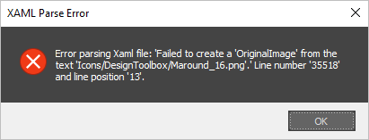

### Error opening 3ds Max

After reinstalling the or updating the tool, this annoying error can occur sometimes:

It is caused by the ribbon interface. Some icon is missing, either because a problem with the installation or because was removed.
To fix it the ribbon interface needs to be reset. Steps to do that:

1. Right-click in the ribbon UI.
2. Choose Ribbon configuration... Reset ribbon to default.
3. Done.

>Please note that if you made any customization or created a custom ribbon tab, and it is not saved and exported as a .xaml file, you will loose the changes. So please save and export your changes before resetting the ribbon.
